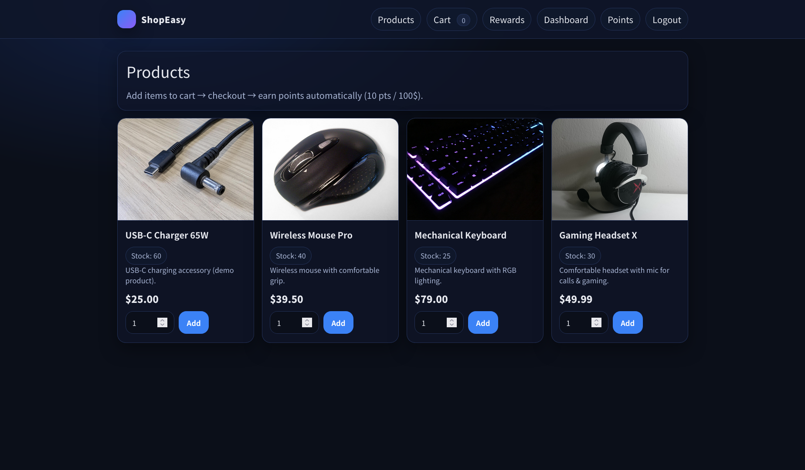
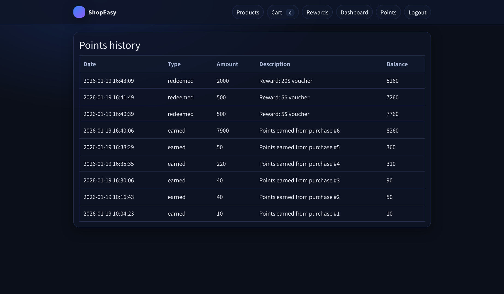

# ShopEasy Loyalty — MVC + Twig (Points & Rewards)
A clean, modular loyalty points system built with **PHP (OOP)** + **MVC architecture** + **Twig templates**.

Developed as part of the **Backend Architecture / MVC & SOLID** brief for ShopEasy.

---

## Table of Contents
- [Project Overview](#project-overview)
- [Educational Objectives](#educational-objectives)
- [Screenshots](#screenshots)
- [Main Features](#main-features)
- [Business Logic & Rules](#business-logic--rules)
- [Database Schema](#database-schema)
- [Routing (Clean URLs)](#routing-clean-urls)
- [Installation & Setup](#installation--setup)
- [Test Accounts](#test-accounts)
- [Project Rules (Quality Standards)](#project-rules-quality-standards)
- [Technologies Used](#technologies-used)
- [Development Workflow](#development-workflow)
- [Deployment](#deployment)
- [License](#license)

---

## Project Overview
**ShopEasy Loyalty** is a loyalty program foundation designed to replace legacy procedural “spaghetti code” with a **professional MVC structure**.

It provides:
- User authentication (register/login/logout)
- A loyalty points engine
- Points history tracking
- Rewards catalog + redeem flow
- Demo shop area (products + cart + **fake payment**) to simulate earning points

The application is designed for scalability: future features like tier rewards, partner integrations, and mobile APIs can be added easily.

---

## Educational Objectives
- Build a web app using **MVC architecture** (Model / View / Controller)
- Apply **SOLID principles** (Single Responsibility, Dependency Injection)
- Use **Twig** templates with clean separation (no PHP in templates)
- Implement business logic in **Services/Models**, not Controllers
- Use **PDO** and prepared statements for database access
- Create **clean URLs** (no `index.php?page=...`)

---

## Application Structure
The project is organized into:

| Layer | Role |
|------|------|
| **Controllers** | Handle HTTP requests + coordinate Models/Services + return views |
| **Models** | Database queries and data access |
| **Services** | Business logic (points calculation, purchase flow, redemption) |
| **Views (Twig)** | UI templates only (no business logic, no SQL) |

---

## Screenshots

```md



```

---

## Main Features
### 1) Authentication
- Register new account
- Login / Logout
- Session persistence

### 2) Loyalty Points Engine
- Automatically awards points after purchase
- Points transactions stored in database
- Dashboard shows total points
- Points history page shows all earned/redeemed records

### 3) Rewards System
- Rewards catalog (name, points required, stock)
- Redeem points for rewards
- Validations:
  - Not enough points
  - Out of stock

### 4) Demo Shop (Products + Cart + Fake Payment)
- Products list with price + image
- Add/remove cart items
- Checkout simulates payment (no real payment)
- Checkout confirmation page
- Purchase triggers points earning

---

## Business Logic & Rules
### Points Calculation Rule
- **10 points for every 100$ spent**
- Uses floor logic:
  - 99$ → 0 points
  - 100$ → 10 points
  - 250$ → 20 points

### Reward Redemption
- User must have enough points
- Stock is decreased when reward stock is limited
- Transaction recorded in `points_transactions`

### Fake Payment
- No real payment API used
- No card data collected/stored
- Only simulates a successful checkout

---

## Database Schema
Database schema is provided in:
- `sql/schema.sql`
- seed data in `sql/seed.sql`

Core tables:
- `users`
- `points_transactions`
- `rewards`

Extra demo tables:
- `products`
- `purchases`
- `purchase_items`

---

## Routing (Clean URLs)
Examples:
- `/login` → Auth login page
- `/register` → Register page (not in navbar unless you use buttons)
- `/products` → Products catalog
- `/cart` → Cart page
- `/checkout` → Demo checkout page
- `/dashboard` → Points overview
- `/points/history` → Points transactions
- `/rewards` → Rewards catalog
- `/rewards/redeem/{id}` → Redeem reward

---

## Installation & Setup
### Requirements
- PHP 7.4+ (tested on PHP 8.x)
- MySQL
- Composer

### Steps
1) Clone repo:
```bash
git clone https://github.com/kara7z/Loyalty-Points-System
cd YOUR_REPO
```

2) Install dependencies:
```bash
composer install
composer dump-autoload -o
```

3) Create DB and import schema:
- Import `sql/schema.sql`
- Import `sql/seed.sql`

4) Configure DB connection:
Edit:
`config/database.php`

5) Run server:
```bash
php -S localhost:8000 -t public public/router.php
```

Open:
- `http://localhost:8000`

> ⚠️ Keep using **localhost** (don’t switch to 127.0.0.1) to avoid session cookie issues.

---

## Test Accounts
After you seed users (or insert manually), you can login.

Example:
- Email: `test@demo.com`
- Password: `123456`

> You can create new users directly from `/register`.

---

## Project Rules (Quality Standards)
✅ MVC Separation:
- Controllers coordinate only
- Models handle database
- Services handle business logic
- Views display only

### Absolute Rules
- ❌ No PHP in Twig templates (only `{{ }}`, ``, `{# #}`)
- ❌ No SQL in Controllers
- ❌ No business logic in Controllers
- ❌ No HTML inside PHP classes

---

## Technologies Used
- **PHP (OOP)** — MVC structure, DI, services
- **Twig** — templates & layout inheritance
- **MySQL + PDO** — database + prepared statements
- **CSS (Grid/Flex)** — responsive UI
- **Git/GitHub** — version control

---

## Development Workflow
**Duration:** 5 days (Agile-style)

- Day 1: Project base + routing + Twig setup
- Day 2: Database schema + models
- Day 3: Authentication + session
- Day 4: Loyalty logic + rewards
- Day 5: Polish + documentation + final tests

---

## Deployment
Add your links when deployed:
- Live site: `...`
- Repo: `...`

---

## License
Educational project.
© 2026 **ShopEasy** — All rights reserved.

---

**Earn. Redeem. Repeat.**  
*ShopEasy Loyalty — scalable foundation for growth.*
